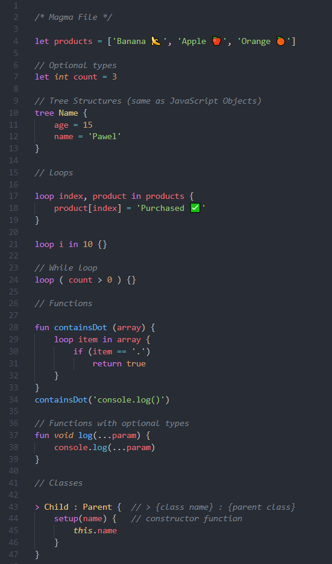

# Magma syntax support extension

## How to use?

1. Create your Magma source file

>  app.mg

1. Once you have that feel free to write your magma code
2. Report any issues or bugs - it will help us developing the extension
## Preview syntax

## Release Notes

### 1.0.0

Initial release of Magma-Language

-----------------------------------------------------------------------------------------------------------
